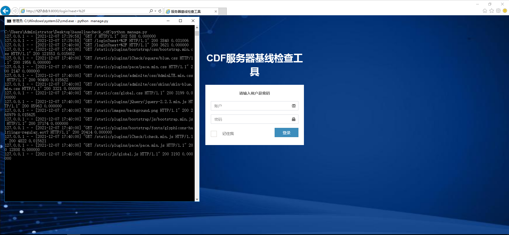
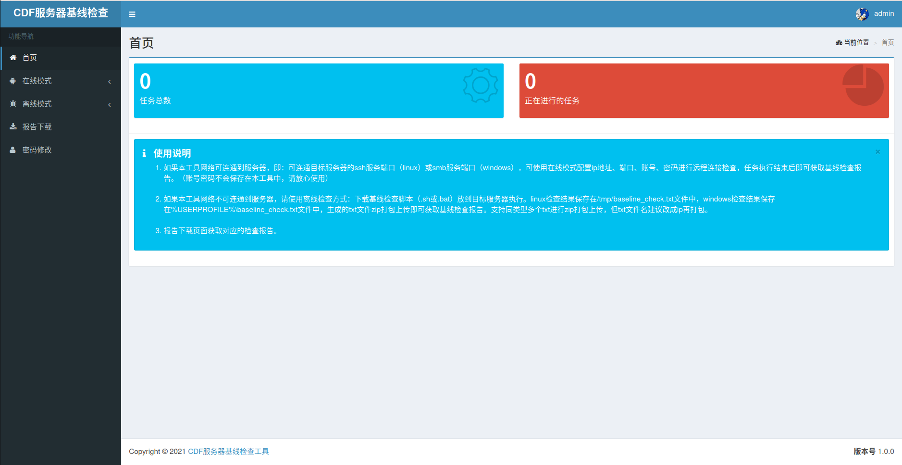
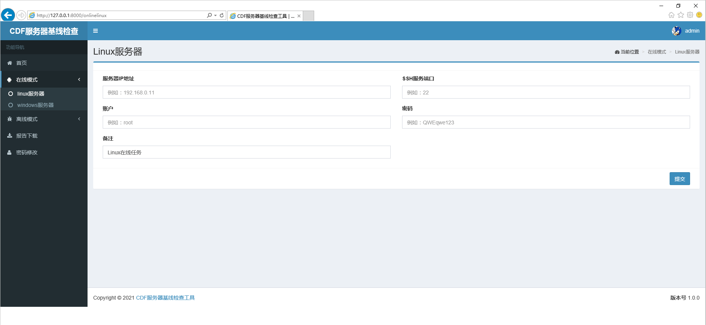
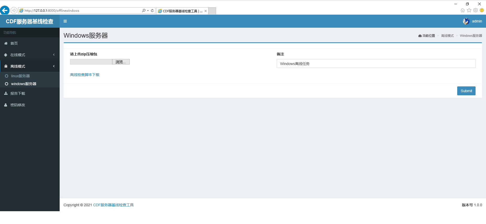

# 服务器基线检查工具_cdf版
**Security check of system baseline**

# 简介

​    上古时期写的工具了，现在看当时写的代码真乱，试了试还是可以使用的，用来对linux系统和windows系统做个简单的基线检查还是可以的（当时在ubuntu18.04\centos7和windows2008\2012测试的该工具，除去win2003、很老的redhat、arch之类的，按理说在常规系统通用）。

​    能够检查的项目可以在模板报告的word中看：windows检查内容(models/Wordtemplate/Windows.docx)、linux检查内容(models/Wordtemplate/Linux.docx)。检查的项目都是根据当时自己的理解和找到的资料整理的。

# 安装

环境需求：python3

第三方库安装：`pip3 install -r requirements.txt`

启动：`python manage.py`

默认帐号/密码：admin/88888888

# 在线模式（即远程连接服务器）

填写ip、端口、帐号、密码提交即可，任务进度和完成状况可在报告下载中查看。

PS：当时脑子抽筋，windows服务器的在线检查用的PsExec.exe远程连接445执行的bat基线检查脚本，所以在线模式检查windows时候需要在windows机器上运行该工具哟。

# 离线模式（即手工去服务器执行脚本）

点击“离线检查脚本下载”链接，下载脚本去服务器上执行（管理员权限执行：root或administrator），并上传结果即可。

# 参考

emmm，当时参考的哪些脚本哪些框架也忘了，反正感谢那些优秀的基线检查工具。
